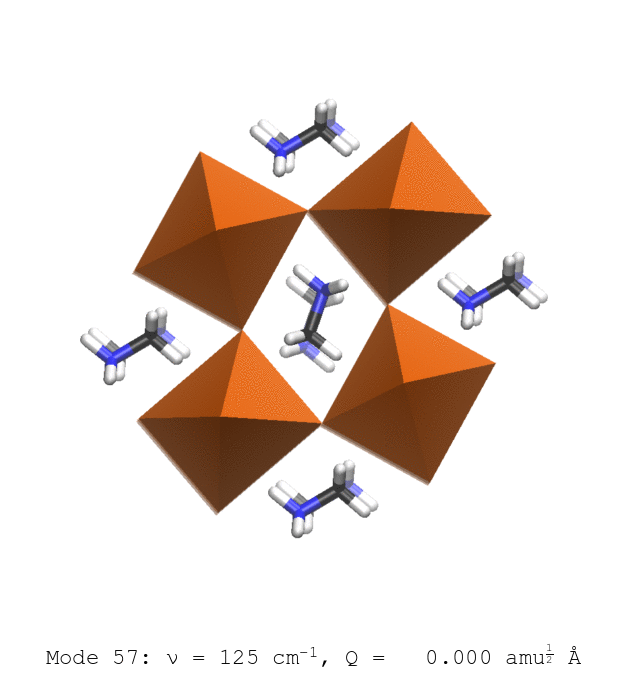

### Keith T. Butler
###### Atomistic modelling for characterisation and design of energy materials

/@fa[address-card]R3 G36/@fa[phone]5334/

----

 / @fa[twitter-square] @keeeto2000 /
@fa[github-square] keeeto /
@fa[at] keith.butler@stfc.ac.uk /

---
### Ferroelectric photovoltaics and photocatalysts 

* How ferroelctricity enhances performance

Ener. Enviro. Sci. 2015 / Appl. Phys. Lett. 2016 / Chem. Mater. 2017

* How does ferroelectricity affect surfaces and interfaces?
	* Charge separation in PV
	* Spatially selective activity in catalysts

---
### Hybrid thermoelectrics and photovoltaics

* Interplay of dynamics, disorder and phase transitions

Nano. Lett. 2014 / Chem. Comm. 2015 / PRB 2016 / Angew. Chem. 2018

* How can we design with disorder?
	* Understand entropy
	* Thermal transport and disorder

---
### Machine learning for characterisation and design

* High throughput exploration of materials space

Chem 2016 / Chem. Sci. 2017 / Faraday Diss. 2018 / Nature 2018

* How can we improve characterisation and understanding with AI?
	* Understand complex phase transitions
	* Guide experimental searches

	
	